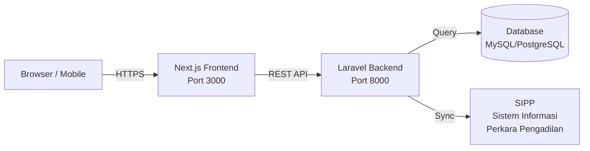
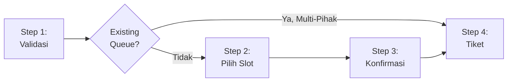
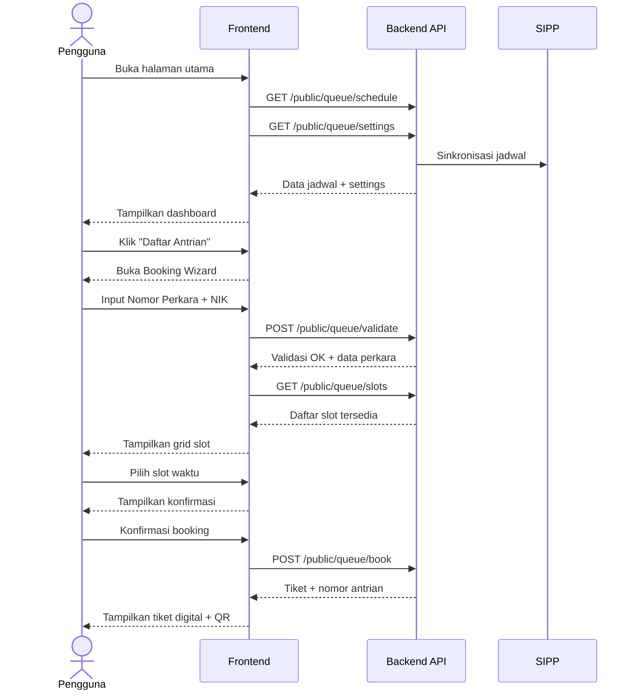

# 📋 Product Requirements Document (PRD)
## Sistem Antrian Sidang — Public Interface

| Field | Detail |
|---|---|
| **Nama Produk** | Antrian Sidang Public |
| **Versi** | 0.1.0 (MVP) |
| **Tanggal** | 23 Mei 2026 |
| **Stakeholder** | Pengadilan Agama Penajam |
| **Tech Lead** | — |
| **Status** | 🟡 Active Development |

---

## 1. Ringkasan Eksekutif

**Antrian Sidang Public** adalah aplikasi web *public-facing* yang memungkinkan masyarakat pencari keadilan untuk mendaftar antrian sidang secara online, melihat jadwal sidang hari ini, dan memantau status antrian secara real-time. Aplikasi ini merupakan **frontend client** yang berkomunikasi dengan backend API terpisah (Laravel-based, port 8000).

### Visi Produk

> Mewujudkan layanan peradilan yang transparan, efisien, dan modern melalui digitalisasi sistem antrian sidang yang dapat diakses oleh seluruh lapisan masyarakat.

### Tujuan Bisnis

1. **Mengurangi waktu tunggu** masyarakat di gedung pengadilan hingga 60%
2. **Meningkatkan transparansi** proses persidangan melalui informasi jadwal real-time
3. **Meminimalisir kerumunan** dengan sistem slot waktu berbasis kapasitas
4. **Memudahkan administrasi** pengadilan dalam mengelola alur persidangan

---

## 2. Target Pengguna

### 2.1 Persona Utama: Pihak Berperkara

| Atribut | Detail |
|---|---|
| **Siapa** | Penggugat, Tergugat, Pemohon, Termohon |
| **Usia** | 25-65 tahun |
| **Literasi Digital** | Rendah hingga menengah |
| **Kebutuhan** | Daftar antrian online, cek jadwal, cek status antrian |
| **Pain Point** | Antre panjang di pengadilan, tidak tahu urutan giliran |

### 2.2 Persona Sekunder: Kuasa Hukum / Pengacara

| Atribut | Detail |
|---|---|
| **Siapa** | Advokat yang mewakili pihak berperkara |
| **Literasi Digital** | Menengah hingga tinggi |
| **Kebutuhan** | Cek jadwal multi-perkara, manajemen waktu efisien |

### 2.3 Persona Tersier: Petugas Pengadilan (view-only)

| Atribut | Detail |
|---|---|
| **Siapa** | Panitera, petugas loket |
| **Kebutuhan** | Memonitor antrian dari layar publik (display mode) |

---

## 3. Arsitektur Teknis

### 3.1 Tech Stack

| Layer | Teknologi | Versi |
|---|---|---|
| **Framework** | Next.js (App Router, Turbopack) | 16.2.3 |
| **Runtime** | React | 19.2.4 |
| **Language** | TypeScript | 5.x |
| **Styling** | Tailwind CSS v4 + CSS Custom Properties | 4.x |
| **Animation** | Framer Motion | 12.38.x |
| **Form** | @tanstack/react-form + Zod validation | 1.29.x / 4.3.x |
| **UI Library** | shadcn/ui + Radix UI + Magic UI | 4.2.x |
| **Font** | Outfit (heading) + Plus Jakarta Sans (body) | Google Fonts |
| **Icons** | Lucide React | 1.8.x |
| **QR Code** | qrcode.react | 4.2.x |
| **Toast** | Sonner | 2.0.x |
| **Theme** | next-themes (light/dark) | 0.4.x |
| **Testing** | Vitest + Testing Library | 4.1.x |
| **Package Manager** | pnpm | 10.33.x |

### 3.2 Arsitektur Sistem



### 3.3 Struktur Direktori

```
antrian-sidang-public/
├── app/                    # Next.js App Router
│   ├── layout.tsx          # Root layout (font, providers, SEO)
│   ├── page.tsx            # Halaman utama (SPA)
│   ├── globals.css         # Design system & theme tokens
│   └── test/               # Halaman test
├── components/
│   ├── features/           # Komponen bisnis
│   │   ├── hero-section.tsx
│   │   ├── queue-status.tsx
│   │   ├── schedule-table.tsx
│   │   ├── booking-modal.tsx
│   │   ├── booking-wizard/  # Multi-step booking flow
│   │   ├── registration-form.tsx (legacy)
│   │   ├── reschedule-dialog.tsx
│   │   ├── floating-action-button.tsx
│   │   ├── slot-card.tsx
│   │   └── form-progress.tsx
│   ├── layout/             # Header, Footer
│   ├── magic/              # Efek visual (blur-fade, shimmer, ticker)
│   ├── providers/          # Hydration provider
│   └── ui/                 # shadcn/ui primitives (15 komponen)
├── contexts/               # React Context (settings, booking modal)
├── lib/                    # API client, service layer, types
└── __tests__/              # Test setup
```

---

## 4. Fitur Produk (Current State)

### 4.1 Hero Section — Dashboard Statistik

| ID | Requirement | Status |
|---|---|---|
| F-HERO-01 | Menampilkan nama instansi dinamis dari API settings | ✅ |
| F-HERO-02 | Statistik real-time: Antrian Terdaftar, Sidang Hari Ini, Tingkat Kehadiran | ✅ |
| F-HERO-03 | Auto-refresh statistik setiap 60 detik | ✅ |
| F-HERO-04 | CTA "Daftar Antrian Sekarang" membuka booking wizard | ✅ |
| F-HERO-05 | CTA "Lihat Jadwal Sidang" scroll ke section jadwal | ✅ |
| F-HERO-06 | Animasi angka (NumberTicker) untuk statistik | ✅ |
| F-HERO-07 | Wave SVG separator antara hero dan konten | ✅ |

### 4.2 Status Antrian Real-Time

| ID | Requirement | Status |
|---|---|---|
| F-QUEUE-01 | Menampilkan nomor antrian yang sedang dipanggil | ✅ |
| F-QUEUE-02 | Statistik: jumlah menunggu & selesai hari ini | ✅ |
| F-QUEUE-03 | Estimasi waktu tunggu (15-20 menit per nomor) | ✅ |
| F-QUEUE-04 | Indikator pulse "Sedang Dipanggil" animasi | ✅ |
| F-QUEUE-05 | Tombol "Cek Status" — cek berdasarkan nomor perkara | ✅ |
| F-QUEUE-06 | Tombol "Ganti Jadwal" — membuka RescheduleDialog | ✅ |
| F-QUEUE-07 | Empty state informatif jika belum ada data | ✅ |
| F-QUEUE-08 | Auto-refresh data setiap 30 detik | ✅ |

### 4.3 Jadwal Sidang Hari Ini

| ID | Requirement | Status |
|---|---|---|
| F-SCHED-01 | Menampilkan daftar jadwal sidang dari API SIPP | ✅ |
| F-SCHED-02 | Informasi per-jadwal: nomor perkara, nama pihak, waktu, ruangan, agenda | ✅ |
| F-SCHED-03 | Badge status berwarna: Terjadwal, Sedang Berlangsung, Selesai, Ditunda | ✅ |
| F-SCHED-04 | Pencarian real-time (filter perkara, pihak, ruangan, agenda) | ✅ |
| F-SCHED-05 | Tombol refresh manual | ✅ |
| F-SCHED-06 | Auto-refresh setiap 60 detik | ✅ |
| F-SCHED-07 | Empty state dengan opsi refresh | ✅ |
| F-SCHED-08 | Responsive layout (card-based, bukan tabel HTML) | ✅ |

### 4.4 Booking Wizard (4-Step Flow)



| ID | Requirement | Status |
|---|---|---|
| F-BOOK-01 | **Step 1 — Validasi**: Input nomor perkara + NIK (16 digit) | ✅ |
| F-BOOK-02 | Validasi NIK terdaftar sebagai pihak di perkara via API | ✅ |
| F-BOOK-03 | Deteksi multi-pihak: jika perkara sudah di-booking pihak lain, berikan nomor antrian yang sama | ✅ |
| F-BOOK-04 | **Step 2 — Pilih Slot**: Grid slot waktu dengan kapasitas tersedia | ✅ |
| F-BOOK-05 | Slot menampilkan: jam, kapasitas total, terisi, tersedia | ✅ |
| F-BOOK-06 | Slot penuh (available=0) otomatis disabled | ✅ |
| F-BOOK-07 | **Step 3 — Konfirmasi**: Ringkasan booking sebelum submit | ✅ |
| F-BOOK-08 | **Step 4 — Tiket Digital**: QR Code, nomor antrian, detail sidang | ✅ |
| F-BOOK-09 | Fitur "Salin Nomor Antrian" ke clipboard | ✅ |
| F-BOOK-10 | Fitur "Cetak Tiket" (print-optimized CSS) | ✅ |
| F-BOOK-11 | Progress bar visual untuk navigasi antar step | ✅ |
| F-BOOK-12 | Navigasi back antar step | ✅ |

### 4.5 Reschedule (Ganti Jadwal)

| ID | Requirement | Status |
|---|---|---|
| F-RESCH-01 | Dialog modal untuk memilih slot baru | ✅ |
| F-RESCH-02 | Menampilkan slot saat ini (disabled) | ✅ |
| F-RESCH-03 | Nomor antrian tetap setelah reschedule | ✅ |

### 4.6 Fitur Non-Fungsional

| ID | Requirement | Status |
|---|---|---|
| NF-01 | Dark mode support | ✅ |
| NF-02 | Responsive design (mobile-first) | ✅ |
| NF-03 | SEO metadata (title, description, OpenGraph) | ✅ |
| NF-04 | Accessibility: skip-link, aria-labels, focus-visible | ✅ |
| NF-05 | Glassmorphism & premium visual design | ✅ |
| NF-06 | Smooth animations (Framer Motion) | ✅ |
| NF-07 | Custom scrollbar styling | ✅ |
| NF-08 | Hydration-safe theme initialization | ✅ |

---

## 5. API Contract

### 5.1 Base URL

```
Production: $NEXT_PUBLIC_API_URL (env variable)
Development: http://localhost:8000/api
```

### 5.2 Endpoints

| Method | Endpoint | Deskripsi | Request | Response |
|---|---|---|---|---|
| `GET` | `/public/queue/schedule` | Jadwal sidang hari ini | — | `ScheduleResponse` |
| `GET` | `/public/queue/settings` | App & institution settings | — | `SettingsResponse` |
| `POST` | `/public/queue/validate` | Validasi perkara + NIK | `ValidateRequest` | `ValidateResponse` |
| `GET` | `/public/queue/slots` | Slot tersedia | `?perkara_id=&date=` | `SlotsResponse` |
| `POST` | `/public/queue/book` | Booking antrian | `QueueBookWizardRequest` | `QueueBookResponse` |
| `GET` | `/public/queue/status/:nomor` | Status antrian | path param | `QueueStatusResponse` |
| `PUT` | `/public/queue/reschedule` | Ganti jadwal | `RescheduleRequest` | `RescheduleResponse` |

### 5.3 Data Models Utama

```typescript
// Tiket Antrian
interface QueueTicket {
  queue_number: string      // Format: "S-001"
  status: QueueStatus       // waiting | in_service | completed | cancelled | skipped | no_show
  pihak_nama: string
  nomor_perkara: string
  ruang_sidang: string | null
}

// Jadwal Sidang (dari SIPP)
interface JadwalSidang {
  id: number
  perkara_id: number
  ruangan: string
  waktu: string             // Datetime string
  jam_sidang: string | null
  agenda: string
  perkara?: {
    nomor_perkara: string
    para_pihak: string | null
    jenis_perkara_nama: string
  }
}

// Slot Waktu
interface SlotInfo {
  time: string              // "08:00", "09:00", dll
  capacity: number
  booked: number
  available: number
}
```

---

## 6. User Flow

### 6.1 Flow Utama: Booking Antrian Baru



### 6.2 Flow Alternatif: Multi-Pihak

Jika perkara sudah di-booking oleh pihak lain:
1. Validasi berhasil → API mengembalikan `existing_queue`
2. Wizard langsung lompat ke Step 4 (Tiket)
3. Pihak baru mendapat **nomor antrian yang sama**

### 6.3 Flow Alternatif: Reschedule

1. Pengguna klik "Ganti Jadwal" di QueueStatus
2. Dialog menampilkan slot tersedia (slot lama disabled)
3. Pengguna pilih slot baru → konfirmasi
4. Backend melepas slot lama, mengambil slot baru
5. Nomor antrian **tidak berubah**

---

## 7. Gap Analysis & Batasan Saat Ini

### 7.1 Fitur Belum Tersedia

| ID | Fitur | Prioritas | Catatan |
|---|---|---|---|
| GAP-01 | **Notifikasi WhatsApp/SMS** | 🔴 Tinggi | Input telepon sudah ada, tapi belum terintegrasi |
| GAP-02 | **Cek Status Mandiri** | 🔴 Tinggi | Tombol ada, handler hanya menampilkan toast "segera tersedia" |
| GAP-03 | **Autentikasi Pengguna** | 🟡 Sedang | Tidak ada login; siapapun bisa booking jika tahu nomor perkara+NIK |
| GAP-04 | **Display Mode** (Layar TV Pengadilan) | 🟡 Sedang | Belum ada halaman khusus untuk tampilan monitor publik |
| GAP-05 | **PWA / Offline Support** | 🟢 Rendah | Belum ada service worker atau manifest |
| GAP-06 | **Riwayat Booking** | 🟡 Sedang | Tidak ada persistensi booking di sisi client |
| GAP-07 | **Multi-bahasa** | 🟢 Rendah | Hanya Bahasa Indonesia |
| GAP-08 | **Analytics / Tracking** | 🟡 Sedang | Tidak ada GA/Mixpanel/PostHog |
| GAP-09 | **Rate Limiting UI** | 🟡 Sedang | Tidak ada throttle pada tombol submit |
| GAP-10 | **Tingkat Kehadiran akurat** | 🔴 Tinggi | Saat ini menggunakan `Math.random()` di hero section |

### 7.2 Technical Debt

| Item | Dampak | Detail |
|---|---|---|
| `registration-form.tsx` (legacy) | Rendah | Masih ada di codebase tapi tidak digunakan. Sebaiknya dihapus. |
| `next.config.ts` + `next.config.js` duplikat | Rendah | Dua file konfigurasi; `next.config.ts` kosong, `next.config.js` aktif |
| Hardcoded estimasi waktu tunggu | Sedang | "15-20 menit" di-hardcode, seharusnya dari data aktual |
| Status jadwal berdasarkan index | Sedang | `mapStatusByIndex()` memberikan status berdasarkan posisi, bukan data real |

---

## 8. Roadmap Pengembangan

### Phase 1: Stabilisasi MVP (Sprint 1-2)

- [ ] Implementasi fitur **Cek Status Mandiri** dengan halaman/dialog dedikasi
- [ ] Hapus `registration-form.tsx` (legacy) dan file konfigurasi duplikat
- [ ] Ganti `Math.random()` tingkat kehadiran dengan data API real
- [ ] Ambil status jadwal dari response API backend (bukan hardcoded by index)
- [ ] Tambahkan rate limiting / debounce pada form submission
- [ ] Tambahkan error boundary global

### Phase 2: Engagement & Notifikasi (Sprint 3-4)

- [ ] Integrasi **notifikasi WhatsApp** saat nomor antrian hampir dipanggil
- [ ] Halaman **Display Mode** untuk layar TV di ruang tunggu pengadilan
- [ ] Implementasi **riwayat booking** dengan localStorage atau cookie
- [ ] Tambahkan **analytics tracking** (PostHog/GA)

### Phase 3: Pengalaman Premium (Sprint 5-6)

- [ ] **PWA support**: service worker, install prompt, offline cache
- [ ] **Push notification** browser untuk update status antrian
- [ ] **Chatbot / FAQ** interaktif untuk pertanyaan umum masyarakat
- [ ] **Aksesibilitas WCAG 2.1 AA** audit dan perbaikan menyeluruh

### Phase 4: Skalabilitas (Sprint 7+)

- [ ] **Multi-tenant**: satu deployment untuk banyak pengadilan
- [ ] **SSO / OAuth** untuk pengacara yang mewakili banyak klien
- [ ] **Integrasi e-Court** (Mahkamah Agung)
- [ ] **Dashboard admin** untuk konfigurasi slot, kapasitas, dan pengumuman

---

## 9. Metrik Keberhasilan (KPI)

| Metrik | Target | Pengukuran |
|---|---|---|
| **Adoption Rate** | 60% pihak berperkara booking online | Jumlah booking online vs walk-in per bulan |
| **Waktu Tunggu Rata-rata** | < 20 menit | Selisih waktu booking slot vs waktu dipanggil |
| **Bounce Rate** | < 30% | Pengunjung yang meninggalkan sebelum booking |
| **Task Completion Rate** | > 85% | Rasio booking berhasil vs booking dimulai |
| **Kepuasan Pengguna** | NPS > 40 | Survey berkala di akhir proses booking |
| **Uptime** | 99.5% | Monitoring server response |

---

## 10. Risiko & Mitigasi

| Risiko | Dampak | Probabilitas | Mitigasi |
|---|---|---|---|
| Literasi digital rendah pada pengguna usia lanjut | Tinggi | Tinggi | Sediakan panduan visual di pengadilan + petugas pendamping |
| Backend/SIPP down saat jam sibuk | Tinggi | Sedang | Graceful error handling + retry logic + offline queue display |
| Penyalahgunaan booking (spam) | Sedang | Sedang | Rate limiting + validasi NIK wajib + CAPTCHA |
| Data SIPP tidak sinkron real-time | Sedang | Tinggi | Polling interval + manual refresh button + timestamp last-sync |

---

## 11. Lampiran

### A. Environment Variables

```env
NEXT_PUBLIC_API_URL=http://localhost:8000/api
```

### B. Menjalankan Proyek

```bash
# Install dependencies
pnpm install

# Development
pnpm dev          # http://localhost:3000

# Build production
pnpm build

# Testing
pnpm test
pnpm test:watch
pnpm test:coverage
```

### C. Test Coverage

Terdapat **10 file test** yang mencakup:
- `queue-status.test.tsx` — Status antrian
- `slot-card.test.tsx` — Komponen slot
- `reschedule-dialog.test.tsx` — Dialog reschedule
- `booking-wizard.test.tsx` — Wizard utama
- `step-validate.test.tsx` — Langkah validasi
- `step-select-slot.test.tsx` — Langkah pilih slot
- `step-confirm.test.tsx` — Langkah konfirmasi
- `step-ticket.test.tsx` — Langkah tiket
- `existing-queue-card.test.tsx` — Card existing queue
- `integration.test.tsx` — Integration test full flow

---

> [!IMPORTANT]
> Dokumen ini merupakan snapshot per **23 Mei 2026**. PRD ini harus di-review dan diperbarui setiap sprint planning untuk memastikan alignment dengan kebutuhan stakeholder dan perkembangan teknis.
